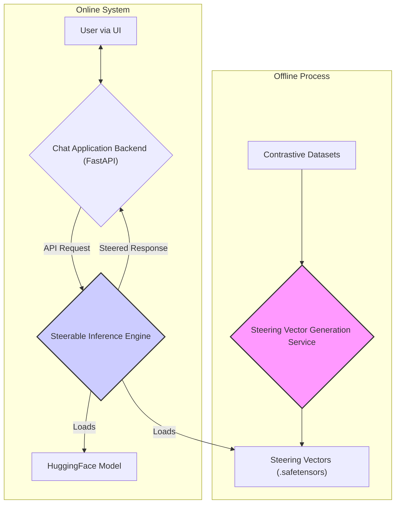
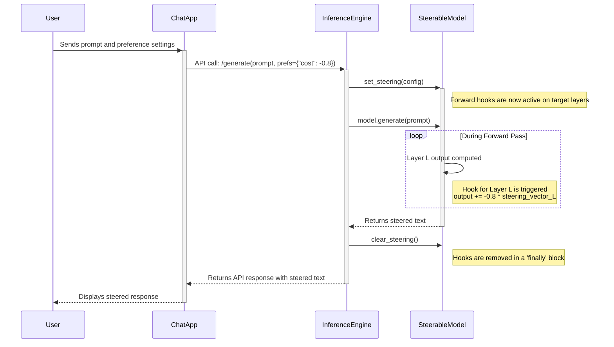

# System Architecture

The SteerLab framework is designed with a clear separation of concerns, decoupling the offline, computationally intensive tasks from the online, low-latency inference services. This architecture ensures scalability, maintainability, and efficient resource utilization.

## High-Level Architecture

The system comprises three primary components: the offline **Steering Vector Generation Service**, the online **Steerable Inference Engine**, and the user-facing **Chat Application Backend**.

### Component Responsibilities

* **Steering Vector Generation Service (Offline):** Responsible for the one-time, offline computation of steering vectors using the Contrastive Activation Addition (CAA) algorithm. It takes contrastive text datasets as input and produces a `.safetensors` file containing the vectors for each model layer.
* **Steerable Inference Engine (Online):** The real-time core of the system. It loads a pre-trained LLM and the pre-computed steering vectors. At inference time, it dynamically modifies the model's internal activations based on incoming API requests.
* **Chat Application Backend (Online):** This service orchestrates the business logic. It manages user sessions, implements the SELECT, CALIBRATE, and LEARN interaction modes, and translates user interactions into precise API calls to the Steerable Inference Engine.

## Steered Inference Request Lifecycle

To ensure robustness and prevent state leakage between requests, PyTorch hooks are managed on a per-request basis.

This lifecycle, particularly the guaranteed cleanup of hooks, is critical for building a reliable multi-tenant service, ensuring each user's request is handled in complete isolation.
